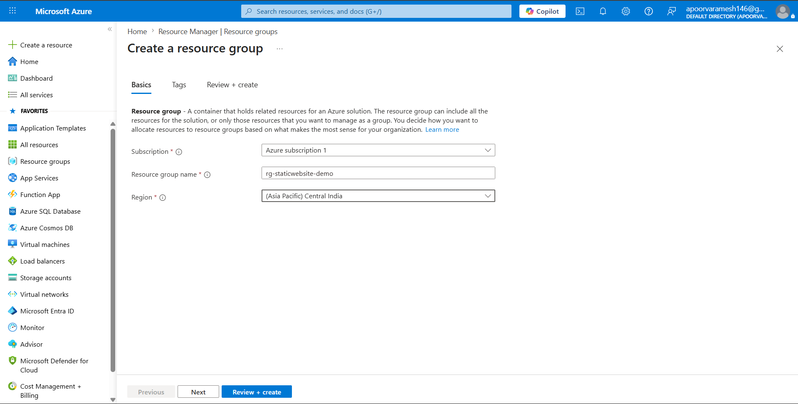
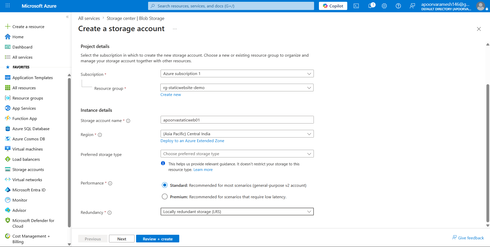
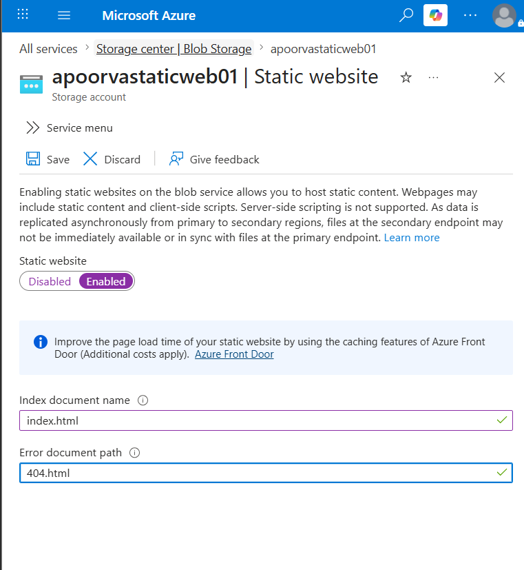
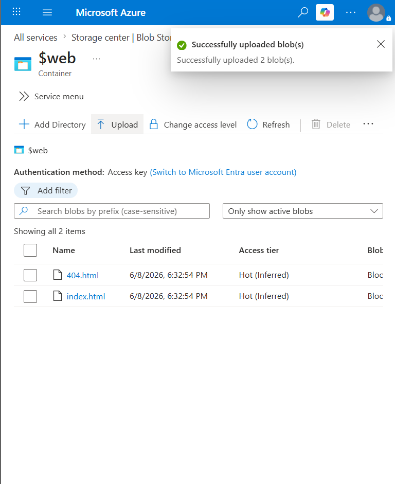
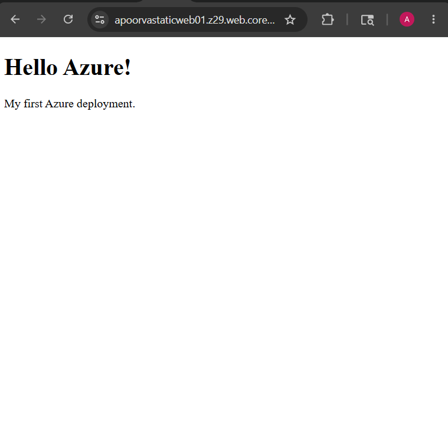

# Azure Static Website Project

## Objective

Deploy a static HTML website using Azure Storage.

## Technologies

- Azure Storage Account
- Static Website Hosting
- HTML/CSS

## Steps Performed

### Step 1
Created Resource Group

### Step 2
Created Storage Account

### Step 3
Enabled Static Website Hosting

### Step 4
Uploaded index.html

### Step 5
Verified website URL

## Challenges

### Issue
Website returned 404.

### Fix
Configured index document properly.

## Result

Successfully hosted website on Azure.

## What I Learned

- Resource Groups
- Storage Accounts
- Blob Containers
- Static Hosting
