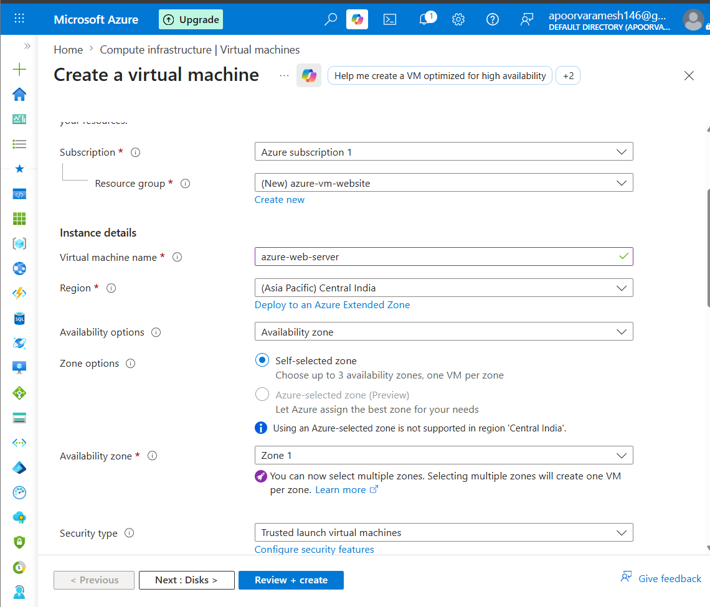
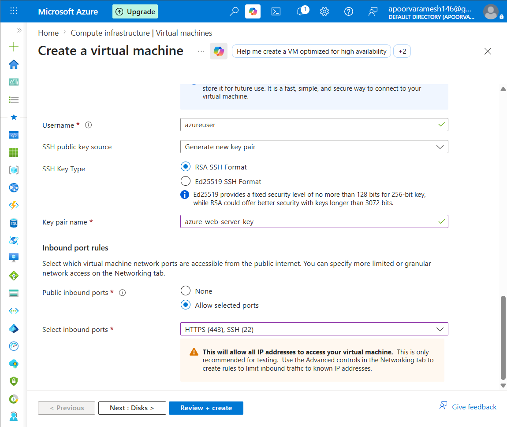
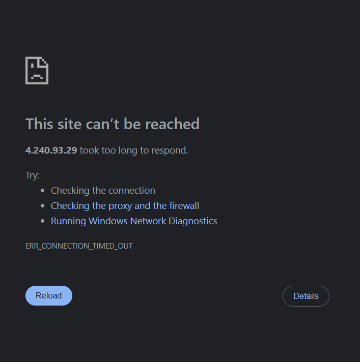

# Azure VM Web Server Deployment

## Objective

Deploy a website using an Azure Virtual Machine.

## Architecture

User
 |
Internet
 |
Azure VM
 |
Nginx Web Server
 |
index.html

## Azure Services Used

- Resource Group
- Virtual Machine
- Virtual Network
- Network Security Group
- Public IP

## Steps

1. Created resource group and VM.

2. Configured networking rules
  Allowed:
    SSH (22)
    HTTP (80)

3. Connected using SSH
4. Installed Nginx
  Commands:

    sudo apt update
    sudo apt install nginx -y
    sudo systemctl start nginx
    sudo systemctl enable nginx

  Verification:

    sudo systemctl status nginx
5. Hosted website

## Concepts Learned

- Compute resources
- Network security rules
- VM management
- Linux server administration

## Challenges

###Debugging
####Error
ERR_CONNECTION_TIMED_OUT

####Resolution

Allowed HTTP traffic and restarted nginx.
